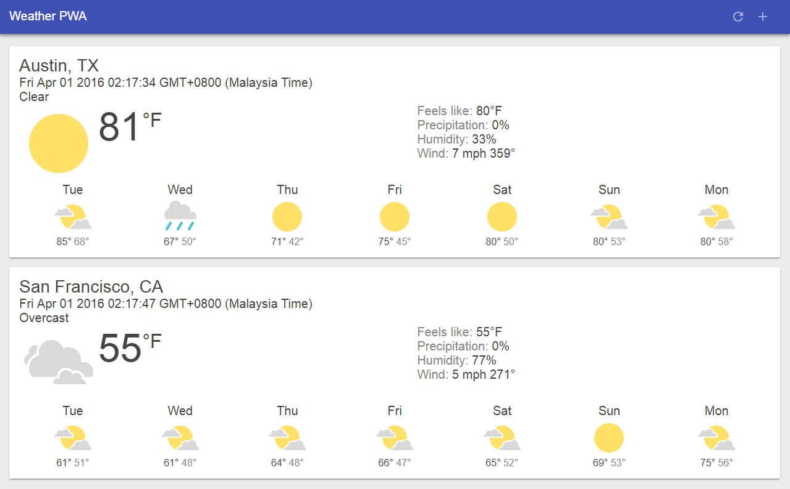

# Weather Web

  

## Getting Started

This is a website developed for project name called "Weather", which developed during [Udacity's Intro to Progressive Web Apps Course](https://www.udacity.com/course/intro-to-progressive-web-apps--ud811).

## Deployment

Hosted presently hosted on [https://weatherapp-e4a0d.firebaseapp.com/](https://weatherapp-e4a0d.firebaseapp.com/).

## Built With

* [Visual Studio Code](https://code.visualstudio.com/)

## Versioning

[Semantic Versioning (SemVer) 2.0.0](http://semver.org/)

## Authors

**Jerry Chong** - [jerrychong25](https://github.com/jerrychong25)

## License

This project base code is originally provided by Udacity's Intro to Progressive Web Apps Course Course Leads Pete LePage and Michael Wales.
